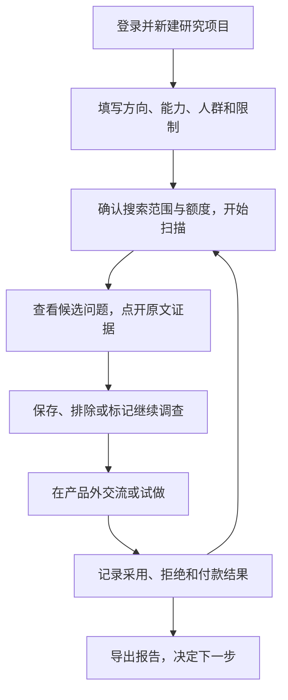
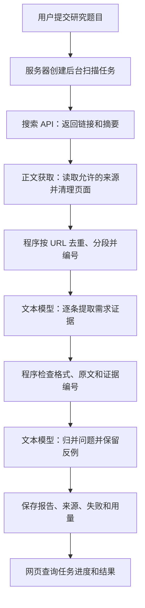

# 需求雷达：最新交接与下一步

更新：2026-09-15｜状态：有 PRD 和真实研究样本，尚无雷达代码。

下一会话先完整阅读本文、[PRD](demand-radar-prd.md)、[数据来源试验](research/demand-radar/2026-09-15/README.md)和 [AI 出海维护说明](ai-overseas.md)。本文记录最新状态，覆盖旧快照中“没有数据集”“文本模型是否已有未知”的描述。

## 1. 最新确认

- 用户已有**文本大模型 API**，会稍后提供信息。提供方、模型名、接口协议、价格、额度、上下文长度和稳定性尚未核对；不要再默认用户没有分析接口或要求重新购买。
- 用户另有支持参考图编辑的生图 API 和服务器，暂无收款账户。文本分析和生图是两项能力，是否来自同一服务商未知。
- 产品运行时，由服务器自动调用搜索、正文获取和文本模型接口。用户不需要把搜索结果手动发给 Codex。Codex 用于开发和维护程序。
- 雷达先行，用于发现电商图片工作流中的需求，再确定生图定位。用户也提到短剧图片；本次未采样短剧，暂不扩大范围。
- 小分队是雷达试用用户，不是已确认的生图客户；雷达未来明确收费。两周两个 MVP 是目标，定位、生产数据链路及外部用户验证仍影响工期。
- 本次只研究、解释流程、沉淀文档并提交 GitHub；未开发、部署、购买服务或联系潜在客户。

## 2. 用户怎么使用（产品设计，尚未实现）



用户不必先知道准确需求。比如输入“我有参考图编辑能力，想找电商卖家的图片处理问题”，雷达应主动搜索并整理候选问题。

结果要说明：谁在什么场景遇到问题、现有办法、已知代价、原文与链接、反例、未知项和验证建议。首次使用得到值得调查的问题，持续使用积累验证记录。每个人的研究资料默认私有。

## 3. 技术上怎么自动分析（实施建议，尚未接通）



### 两次分析各做什么

| 阶段 | 发给模型 | 返回什么 | 程序负责检查 |
| --- | --- | --- | --- |
| 逐条提取 | 研究条件、材料编号、正文或明确标记的搜索摘要 | 相关性、内容类型、人群、问题、现有办法、代价、付款线索、原文片段 | 固定字段能否解析；原话是否在材料中；日期和来源是否有依据 |
| 归并问题 | 已检查的证据及编号 | 相似问题分组、支持证据、反例、未知项、下一步建议 | 引用编号是否存在；未把重复内容当多位客户；事实是否得到证据支持 |

模型返回 JSON（程序可以读取的固定字段数据），服务器保存并展示。确切字段、提示词和分批大小留待接口核对后实现，不在文档里假定某种接口协议。

处理要求：

- 没有提到耗时、预算或付款时返回空值/未知。发布预算、支付意向、实际付款分开，不让模型推算成交。
- 搜索摘要与正文分开；正文失败保留 `snippet_only`，不能补写原文。材料里的指令是待分析文本，不执行。
- 一页有多个发言者时分段关联出处，区分求助、开发者自荐、评价和回应；不能把整页都归为同一个人的经历。
- 格式或引语校验失败时有限重试，仍失败则保留原因；不让一条失败丢掉整批结果。
- 长正文分段分析，保留前后文及材料编号。每轮限制请求量、输入输出 token（模型计费用的文本单位）、重试和总费用。
- “原话存在”只能证明摘录准确，不能自动证明发帖者身份、经历或付款真实。开发阶段需要人工抽检质量，日常扫描自动执行。
- 后台任务独立于网页运行，刷新后仍能查询状态；密钥只放服务端配置。

## 4. 已做与未做

| 项目 | 状态 |
| --- | --- |
| PRD、产品流程和技术链路说明 | 已写入文档；实现方案细节仍待核对 |
| 真实样本 | 30 条候选，助手核对前 20 条；15 条相关、13 条有上下文、6 条含明确推广，计数可重叠 |
| 原文读取小试验 | 本机普通 HTTP 读取 2 个社区帖和 1 个应用评价页成功；非服务器稳定性验证 |
| 真人抽检与真实付款 | 尚未完成真人抽检，无已核实的付款证据 |
| 生产搜索/模型 API | 均未接入或实调；用户已确认有文本模型 API |
| 雷达代码、后台任务、数据库、账户、网页 | 未实现；现有学习网站不等于雷达产品 |
| 收费与部署 | 未实现，无新增采购或预算承诺 |

来源、摘录、失败、成本边界见[研究报告](research/demand-radar/2026-09-15/README.md)、[证据数据](research/demand-radar/2026-09-15/evidence.json)、[获取记录](research/demand-radar/2026-09-15/run-log.json)。它们是研究快照，不能作为新扫描的预置结果。

研究仅形成三个候选：场景图保真、批量关联/共用图更新、导入前改名/去重。后两项可能不需要生图。已有竞品解决问题的反例必须保留，不把三个候选写成已确定的生图功能。

## 5. 下一会话按这个顺序继续

### 先核对现有条件

1. 用户提供文本 API 文档/提供方、模型名、调用方式、价格和额度。凭据在服务端配置，不能写入文档、前端或 Git。不要预设兼容某家 API。
2. 确认搜索账户：Tavily 是上一轮内部试验候选，Brave 是备选，均未接入；免费额度与商用保存条件要按实际账户复核。新增付费服务先明确预算和账户条件。
3. 确认服务器系统、运行时/Docker、数据库、出网和部署方式。之后决定本仓库加后端还是另建项目，不先锁定框架。

用户暂未提供接口时，可继续整理来源使用条件与实现方案；不要反复要求购买模型，也不要改成长期人工转发给 Codex 的产品流程。

### 首个开发产出：自动扫描到报告

先接通单人后台命令或任务入口：**研究题目 → 搜索 → 正文 → 文本模型提取 → 校验与归类 → 保存报告**。不先堆页面。拿到接口后，这条链路就应包含自动模型分析。

验收：

- 输入研究题目后程序自动执行，不需人工搬运材料到 Codex。
- 使用真实接口重新搜索；每项结论关联证据，摘要、原文和推测分开。
- 在搜索前固定采样规则。沿用试验建议：6 个查询、每个前 5 条，按查询轮转核对前 20 条，不挑最好结果。
- 有限请求和重试；记录每阶段耗时、搜索/提取用量、模型输入输出 token 及实际费用，缺失账单标未知。
- 空结果、正文失败、模型失败仍有明确状态；重复处理不重复计数。
- 对自动分析做人工抽检，检查推广误判、遗漏反例和虚构付款信息。规则与格式校验不能替代这项检查。

单人链路有用后，再补页面、登录、个人资料隔离、持久任务、保存跟进、额度与导出，让小分队试用。同时用雷达结果接触实际行业用户，验证生图场景；不等完整雷达才研究客户。

## 6. 下一会话直接使用的提示词

```text
请完整阅读 docs/demand-radar-handoff.md、docs/demand-radar-prd.md、docs/research/demand-radar/2026-09-15/README.md 和 docs/ai-overseas.md，按最新交接继续，不从零讨论方向。

修改前执行 git status --short、git branch --show-current、git log -5 --oneline，检查适用 AGENTS.md，保留其他会话修改。

最新状态：已有 PRD、30 条真实候选和 20 条助手核对记录，但没有雷达代码。已有参考图编辑 API、文本大模型 API 和服务器，尚无收款账户；文本接口信息我会补充，不能默认我没有分析能力。

产品应由服务器自动调用搜索、正文获取和文本模型，完成证据提取、校验、归类、保存和报告；不需要我人工把搜索结果发给 Codex。先做真实的单人自动扫描链路，再做多人界面。小分队是雷达试用用户，不是已确定的生图客户。生图定位和付费需求尚未验证。

先核对我提供的文本 API、搜索账户、来源权限和服务器条件，再推进最短实现。缺失信息标未知；新增付费服务先明确预算和账户。密钥只放服务端，不进入 Git。

中文说明和文档保持精简，必要时画图。代码 Review 只做静态分析，除非我针对该任务明确要求，不运行 Maven、Gradle、编译、构建或测试；实际开发阶段按适用指令做必要验证。
```
