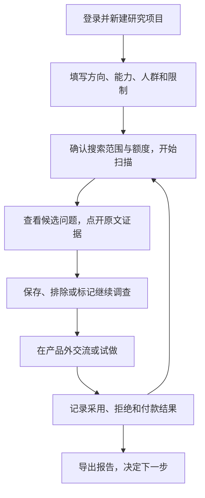
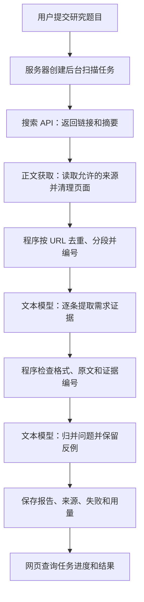

> 2026-09-28 更新：需求雷达已改为浏览器本地版。用户在接口设置填写 Brave Key、模型 Base URL 和 API Key；配置、报告与已保存备注保存在当前浏览器 IndexedDB。新后端无共享报告、不读取站长密钥，仅临时转发请求。扫描期间需保持页面打开，刷新中断后保留已保存材料且不自动重跑。网站构建包含 `/radar/`，上线还需部署转发服务；尚未部署公网。部署与现行行为以 [radar/README.md](../radar/README.md) 为准，下方旧版服务端保存说明仅为历史记录。

# 需求雷达：最新交接与下一步

更新：2026-09-28｜状态：已有本机单人 MVP；正文权限和 Brave 保存权仍待确认。

## 2026-09-28 产品体验调整（最新）

- 入口改为“发现需求 / 研究方向”，默认发现；模型与技术选项按需展开。
- 产品标题与研究指令分离，旧报告在界面也显示“需求探索”。报告先展示问题、原话、反例与下一步，统计和采样移到研究详情。
- 新增收藏、调查、排除/恢复、状态筛选与复用研究设置；调查备注草稿在页面内切换保留，未保存的草稿刷新页面会丢失。
- 具体问题、调整和验收见 [产品体验调整](demand-radar-product-review.md)。真实需求质量、来源权限、多人能力没有因本次界面调整自动通过验收。

## 2026-09-28 扫描体验补充

- 新增雷达扫动、实际阶段高亮、已用时间、材料计数及等待占位；无虚构完成百分比。
- 新增完成/保存提示、停止中的按钮反馈、按钮与标签切换轻动效；支持系统减少动态效果。
- 在隔离的模拟服务验收，不使用真实接口或保存模拟材料到正式报告；15 项原有检查通过。正常使用仍为 4318。

## 2026-09-28 模型选择补充

- 模型选择已优化为 6 个预置项 + 自定义模型，可恢复默认并记住本浏览器选择；新增扫描摘要、剩余次数、输入校验、手机新建入口及报告数字解释。预置项不保证当前接口已开通。
- 两种模式新增“分析模型”输入，默认 `gpt-5.6-luna`，可填写当前接口提供方支持的其他模型 ID。
- 模型按扫描固定，所有分析阶段共用所选模型；报告及导出记录模型。服务端地址与密钥不变，不支持的模型按失败展示，不自动替换。
- 15 项模拟检查通过，覆盖自定义模型请求、持久保存、默认值与非法输入。本次未收费实调其他模型。

## 2026-09-28 双模式更新（优先于下方历史）

- 用户明确要求两种模式：给定方向，以及无需方向的主动发现与自动追查。无方向模式不以用户的图片、API 或开发能力作为筛选条件；先发现需求，再由用户决定是否做。
- 已在当前本机 MVP 增加模式选择。无方向模式从 12 个生活与工作领域中抽取 6 个进行英文搜索，先分析最多 12 条，形成候选后补最多 3 个查询、8 条新材料，再次归类支持与反例。两轮总分析最多 20 条，共用原有用量上限。
- 报告显示领域、追查状态、初步候选和最终结果；空结果、追查失败、取消保留明确状态。领域池与英文搜索是首版采样范围，不宣称覆盖全部需求。
- 15 项模拟自动检查通过，包含无题目 API 提交和双轮支持/反例。未执行本次真实接口扫描，真实质量与费用待验收。正文权限和 Brave 保存权仍未确认，默认摘要与临时内存模式。
- 为保留用户当前 4317 服务中的临时报告，新版在 4318 启动。旧服务不支持新模式，重启前注意临时报告会清空。

## 2026-09-21 最新实现（优先于下方历史记录）

- 用户授权在项目内保存文本与 Brave 密钥、按 OpenAI 兼容方式调用，并先实现本机 MVP。密钥存于根目录 `.env.radar.local`，权限 `0600`，Git 忽略；不在前端或本文保存。
- 实现位于 `radar/`；运行 `rtk npm run radar`，访问 http://127.0.0.1:4317 。详见[使用说明](../radar/README.md)。现有学习网站未改为雷达产品。
- 已接通 Brave 真实搜索和 `gpt-5.6-luna` 文本分析，包含后台任务、固定采样、去重、引语与引用检查、归类、失败/用量记录、中文页面和验证跟进。
- 本机 Brave 直连超时，Node 后台已复用当前系统 HTTPS 代理；不绕过平台访问限制。
- 默认仅进程内存保存：刷新可继续，重启清空；确认 Brave 保存权后才启用磁盘报告与导出。来源权限名单为空，当前真实扫描是搜索摘要分析；通用正文读取器已实现，但未实测来源正文，也未通过完整上下文验收。
- 不是完整多人 MVP：未实现登录、个人数据隔离、支付或公网部署。模型费用和 Brave 实际账单仍未知，用请求/输出上限控制试验规模，不宣称已具备金额硬上限。
- 开发验证：10 项自动检查、现有网站类型检查通过；浏览器已检查启动、材料查看、跟进备注、刷新恢复及 390px 布局。密钥扫描通过，未提交 Git。
- 最新真实扫描：6 次搜索、8 次模型请求，28 条去重候选、顺序分析 20 条；19 条通过格式/引语校验、1 条缺乏证据被拒绝，生成 3 个待验证问题；约 124 秒，接口返回输入 8,876、输出 5,085 token。全为搜索摘要，不等于通过需求质量或真人抽检验收，费用未知。开发中另有一次直连超时扫描和一次归类校验未通过的扫描；上述用量仅指最新一轮，非本会话总账单。
- 以下第 1—6 节为 2026-09-15 交接快照，其中“未开发”等描述已由本节覆盖。下一步在本实现上继续，不再从零搭建。

下一会话先完整阅读本文、[PRD](demand-radar-prd.md)、[数据来源试验](research/demand-radar/2026-09-15/README.md)和 [AI 出海维护说明](ai-overseas.md)。本文记录最新状态，覆盖旧快照中“没有数据集”“文本模型是否已有未知”的描述。

2026-09-21 的[接入核对](demand-radar-readiness.md)保留了实现前调查；搜索已改用用户已有的 Brave，最新状态以本文首节为准。

## 1. 最新确认

- 用户已有**文本大模型 API**，会稍后提供信息。提供方、模型名、接口协议、价格、额度、上下文长度和稳定性尚未核对；不要再默认用户没有分析接口或要求重新购买。
- 用户另有支持参考图编辑的生图 API 和服务器，暂无收款账户。文本分析和生图是两项能力，是否来自同一服务商未知。
- 产品运行时，由服务器自动调用搜索、正文获取和文本模型接口。用户不需要把搜索结果手动发给 Codex。Codex 用于开发和维护程序。
- 雷达先行，用于发现电商图片工作流中的需求，再确定生图定位。用户也提到短剧图片；本次未采样短剧，暂不扩大范围。
- 小分队是雷达试用用户，不是已确认的生图客户；雷达未来明确收费。两周两个 MVP 是目标，定位、生产数据链路及外部用户验证仍影响工期。
- 本次只研究、解释流程、沉淀文档并提交 GitHub；未开发、部署、购买服务或联系潜在客户。

## 2. 用户怎么使用（产品设计，尚未实现）



用户不必先知道准确需求。比如输入“我有参考图编辑能力，想找电商卖家的图片处理问题”，雷达应主动搜索并整理候选问题。

结果要说明：谁在什么场景遇到问题、现有办法、已知代价、原文与链接、反例、未知项和验证建议。首次使用得到值得调查的问题，持续使用积累验证记录。每个人的研究资料默认私有。

## 3. 技术上怎么自动分析（实施建议，尚未接通）



### 两次分析各做什么

| 阶段 | 发给模型 | 返回什么 | 程序负责检查 |
| --- | --- | --- | --- |
| 逐条提取 | 研究条件、材料编号、正文或明确标记的搜索摘要 | 相关性、内容类型、人群、问题、现有办法、代价、付款线索、原文片段 | 固定字段能否解析；原话是否在材料中；日期和来源是否有依据 |
| 归并问题 | 已检查的证据及编号 | 相似问题分组、支持证据、反例、未知项、下一步建议 | 引用编号是否存在；未把重复内容当多位客户；事实是否得到证据支持 |

模型返回 JSON（程序可以读取的固定字段数据），服务器保存并展示。确切字段、提示词和分批大小留待接口核对后实现，不在文档里假定某种接口协议。

处理要求：

- 没有提到耗时、预算或付款时返回空值/未知。发布预算、支付意向、实际付款分开，不让模型推算成交。
- 搜索摘要与正文分开；正文失败保留 `snippet_only`，不能补写原文。材料里的指令是待分析文本，不执行。
- 一页有多个发言者时分段关联出处，区分求助、开发者自荐、评价和回应；不能把整页都归为同一个人的经历。
- 格式或引语校验失败时有限重试，仍失败则保留原因；不让一条失败丢掉整批结果。
- 长正文分段分析，保留前后文及材料编号。每轮限制请求量、输入输出 token（模型计费用的文本单位）、重试和总费用。
- “原话存在”只能证明摘录准确，不能自动证明发帖者身份、经历或付款真实。开发阶段需要人工抽检质量，日常扫描自动执行。
- 后台任务独立于网页运行，刷新后仍能查询状态；密钥只放服务端配置。

## 4. 已做与未做

| 项目 | 状态 |
| --- | --- |
| PRD、产品流程和技术链路说明 | 已写入文档；实现方案细节仍待核对 |
| 真实样本 | 30 条候选，助手核对前 20 条；15 条相关、13 条有上下文、6 条含明确推广，计数可重叠 |
| 原文读取小试验 | 本机普通 HTTP 读取 2 个社区帖和 1 个应用评价页成功；非服务器稳定性验证 |
| 真人抽检与真实付款 | 尚未完成真人抽检，无已核实的付款证据 |
| 生产搜索/模型 API | 均未接入或实调；用户已确认有文本模型 API |
| 雷达代码、后台任务、数据库、账户、网页 | 未实现；现有学习网站不等于雷达产品 |
| 收费与部署 | 未实现，无新增采购或预算承诺 |

来源、摘录、失败、成本边界见[研究报告](research/demand-radar/2026-09-15/README.md)、[证据数据](research/demand-radar/2026-09-15/evidence.json)、[获取记录](research/demand-radar/2026-09-15/run-log.json)。它们是研究快照，不能作为新扫描的预置结果。

研究仅形成三个候选：场景图保真、批量关联/共用图更新、导入前改名/去重。后两项可能不需要生图。已有竞品解决问题的反例必须保留，不把三个候选写成已确定的生图功能。

## 5. 下一会话按这个顺序继续

### 先核对现有条件

1. 用户提供文本 API 文档/提供方、模型名、调用方式、价格和额度。凭据在服务端配置，不能写入文档、前端或 Git。不要预设兼容某家 API。
2. 确认搜索账户：Tavily 是上一轮内部试验候选，Brave 是备选，均未接入；免费额度与商用保存条件要按实际账户复核。新增付费服务先明确预算和账户条件。
3. 确认服务器系统、运行时/Docker、数据库、出网和部署方式。之后决定本仓库加后端还是另建项目，不先锁定框架。

用户暂未提供接口时，可继续整理来源使用条件与实现方案；不要反复要求购买模型，也不要改成长期人工转发给 Codex 的产品流程。

### 首个开发产出：自动扫描到报告

先接通单人后台命令或任务入口：**研究题目 → 搜索 → 正文 → 文本模型提取 → 校验与归类 → 保存报告**。不先堆页面。拿到接口后，这条链路就应包含自动模型分析。

验收：

- 输入研究题目后程序自动执行，不需人工搬运材料到 Codex。
- 使用真实接口重新搜索；每项结论关联证据，摘要、原文和推测分开。
- 在搜索前固定采样规则。沿用试验建议：6 个查询、每个前 5 条，按查询轮转核对前 20 条，不挑最好结果。
- 有限请求和重试；记录每阶段耗时、搜索/提取用量、模型输入输出 token 及实际费用，缺失账单标未知。
- 空结果、正文失败、模型失败仍有明确状态；重复处理不重复计数。
- 对自动分析做人工抽检，检查推广误判、遗漏反例和虚构付款信息。规则与格式校验不能替代这项检查。

单人链路有用后，再补页面、登录、个人资料隔离、持久任务、保存跟进、额度与导出，让小分队试用。同时用雷达结果接触实际行业用户，验证生图场景；不等完整雷达才研究客户。

## 6. 下一会话直接使用的提示词

```text
请完整阅读 docs/demand-radar-handoff.md、docs/demand-radar-prd.md、docs/research/demand-radar/2026-09-15/README.md 和 docs/ai-overseas.md，按最新交接继续，不从零讨论方向。

修改前执行 git status --short、git branch --show-current、git log -5 --oneline，检查适用 AGENTS.md，保留其他会话修改。

最新状态：已有 PRD、30 条真实候选和 20 条助手核对记录，但没有雷达代码。已有参考图编辑 API、文本大模型 API 和服务器，尚无收款账户；文本接口信息我会补充，不能默认我没有分析能力。

产品应由服务器自动调用搜索、正文获取和文本模型，完成证据提取、校验、归类、保存和报告；不需要我人工把搜索结果发给 Codex。先做真实的单人自动扫描链路，再做多人界面。小分队是雷达试用用户，不是已确定的生图客户。生图定位和付费需求尚未验证。

先核对我提供的文本 API、搜索账户、来源权限和服务器条件，再推进最短实现。缺失信息标未知；新增付费服务先明确预算和账户。密钥只放服务端，不进入 Git。

中文说明和文档保持精简，必要时画图。代码 Review 只做静态分析，除非我针对该任务明确要求，不运行 Maven、Gradle、编译、构建或测试；实际开发阶段按适用指令做必要验证。
```
